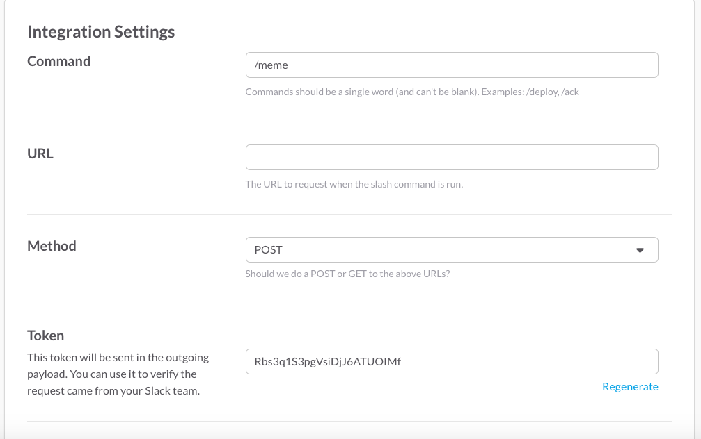
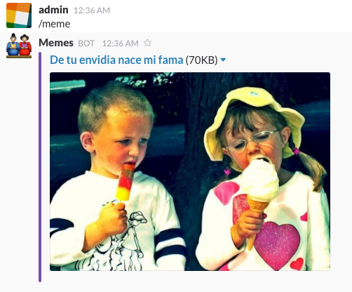

# Cómo hacer un comando personalizado de Slack

Una de las principales ventajas de usar Slack respecto de Skype o cualquier otra alternativa de mensajería es la capacidad de extenderse hasta donde tú quieras. Permite que desarrolles tus propios usuarios bot y que te contesten lo que quieras de forma automatizada. Permite crear aplicaciones que puedan leer los mensajes para sacar estadísticas, que envíen mensajes a usuarios en determinados momentos o que notifiquen cuando se ha leído un mensaje.

En este post se va a hablar de una de las más útiles y sencillas. Los comandos personalizados *slash*.

Se va a detallar todo el proceso de creación del comando y el servidor web necesario para que funcione. Este servidor web será el encargado de procesar y preparar lo que queramos que devuelva el comando en el canal en el que se ejecute.

Si tienes cualquier duda extra siempre puedes usar la ayuda oficial: [Slash Commands en Slack](https://api.slack.com/slash-commands)

## Cómo funcionan los comandos de Slack

Cuando se ejecuta un comando personalizado de Slack, los servidores del servicio hacen una llamada GET o POST (a elegir) a la url que definamos con una serie de campos a través de queryparameters.
Por ejemplo, el comando `/test hola!` haría una llamada a nuestro endpoint con los siguientes parámetros:

```
token=gIkuvaNzQIHg97ATvDxqgjtO
team_id=T0001
team_domain=girosp
channel_id=C2147483705
channel_name=test
user_id=U2147483697
user_name=admin
command=/test
text=hola!
response_url=https://hooks.slack.com/commands/1234/5678
```

Cada campo es un detalle del contexto en el que se ha invocado el comando, se puede ver el equipo, canal y usuario relativos a la ejecución.

Se tiene que contestar a esta llamada con un `200 OK` y JSON de este estilo:

```json
{
    "text": "¡Hola Mundo!",
    "response_type": "in_channel",
    "attachments": [
        {
            "text":"Este es un adjunto de prueba"
        }
    ]
}
```

Si logramos contestar antes de 3 segundos, el canal o la conversación donde se haya ejecutado el comando verá un nuevo mensaje que diga ¡Hola Mundo!.
Muy fácil ¿no?

## Ejemplo del comando /meme

Vamos a crear un nuevo comando en nuestro equipo de Slack. La idea es que se muestre la imagen de un meme o cualquier otra imagen graciosa cada vez que se ejecute el comando /meme en cualquiera de los canales de Slack del equipo.

Lo primero es ir a la [página de creación de comandos](https://my.slack.com/services/new/slash-commands) de tu equipo y rellenar los datos.



La URL es el endpoint completo al que Slack llamará cuando el comando sea ejecutado por alguien. Es el encargado de la lógica de todo, será el que busque el meme o imagen graciosa por donde tenga definido y devuelva el JSON asociado al mensaje. Luego se explicará cómo preparar el servidor web, por ahora en nuestro caso es algo así:
`http://******.ngrok.io/api/commands/meme`

El token sirve para comprobar la veracidad de las llamadas. Para asegurarnos de que quien ataca a nuestro API es Slack y por lo tanto podemos dar por cierto que alguien ha ejecutado el comando.

Es muy recomendable activar para que se vea el comando en la lista de comandos disponibles y añadir una pequeña ayuda indicando si acepta parámetros, devuelve algo...

Una vez creado el comando, Slack está esperando que contestemos las llamadas que nos hacen a nuestro api con mensajes. Así que ahora vamos a diseñar cómo queremos que se vean los mensajes que responda nuestro comando.

## Diseñando mensajes de respuesta



Los mensajes de respuesta pueden tener un título, descripción, link, pero lo más importante, puede tener uno o muchos adjuntos. El JSON asociado a la captura que se muestra es:

```javascript
{
  "response_type": "in_channel",
  "attachments": [
    {
      "title": "De tu envidia nace mi fama\n",
      "title_link": "http://yonkiblog.com/de-tu-envidia-nase-mi-fama/",
      "image_url": "http://41.media.tumblr.com/c27a5fd05e908f94d457ea3331339e89/tumblr_o5rumzl0t21slstjgo4_500.jpg",
      "color": "#764FA5"
    }
  ]
}
```

El campo `response_type` indica si quieres que el mensaje sea visible para todos en el canal (`in_channel`) o sólo para el que lo ha ejecutado (`ephemeral`).

En este caso el adjunto únicamente tiene un título, el link, la imagen (puede tener `thumb_url`) y el color de la barra de la izquierda que recorre todo el adjunto.

Puedes trastear todo lo que quieras para diseñar el mensaje que más te guste con el [Message Builder](https://api.slack.com/docs/formatting/builder?msg=%7B%22attachments%22%3A%5B%7B%22title%22%3A%22De%20tu%20envidia%20nace%20mi%20fama%5Cn%22%2C%22title_link%22%3A%22http%3A%2F%2Fyonkiblog.com%2Fde-tu-envidia-nase-mi-fama%2F%22%2C%22image_url%22%3A%22http%3A%2F%2F41.media.tumblr.com%2Fc27a5fd05e908f94d457ea3331339e89%2Ftumblr_o5rumzl0t21slstjgo4_500.jpg%22%2C%22color%22%3A%22%23764FA5%22%7D%5D%7D)

Todo texto es susceptible de formatear prácticamente casi de la forma en la que usas Slack. Puedes añadir saltos de línea con `\n`, enlaces de la forma `<http://link.com>`, usar variables y hasta insertar emojis.

Puedes ver más acerca del formato que soportan los campos de los mensajes en [Message Formatting](https://api.slack.com/docs/formatting) y en [Attachments](https://api.slack.com/docs/attachments) para ver todas las opciones que permiten los adjuntos en mensajes de Slack.

Una vez has conseguido devolver un JSON como el de antes a través de una url accesible desde internet podrás decir que ya has hecho un comando de Slack. 

Si no sabes cómo crear tu servicio web o te estás planteando diferentes alternativas, en el siguiente artículo se detallará cómo crear tu servidor NodeJS con Loopback para que tus mensajes tengan todo el sentido del mundo. O no, eso ya es cosa tuya.
